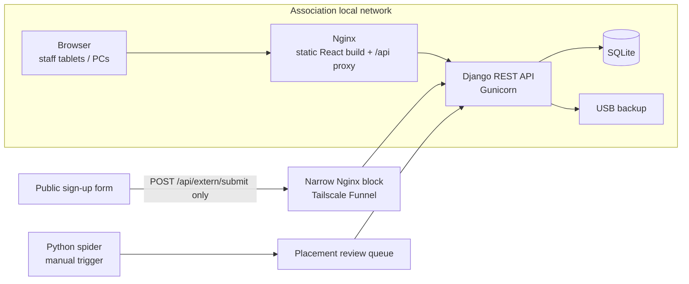
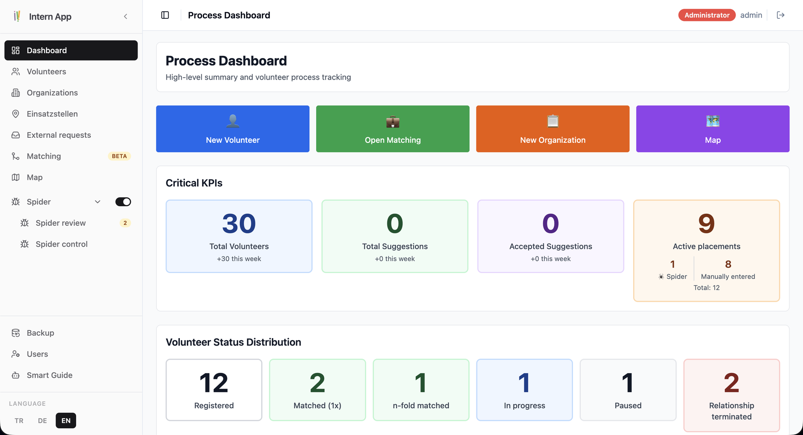
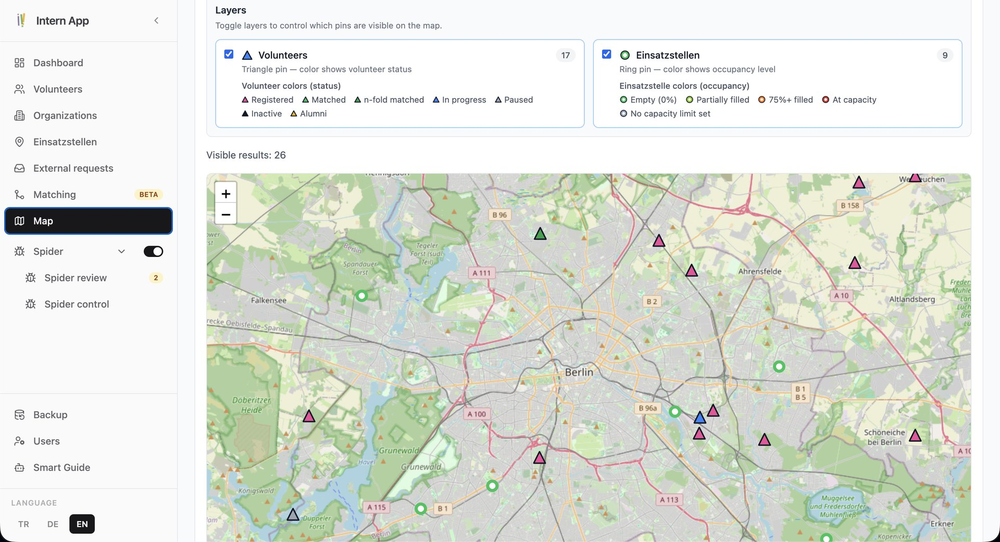
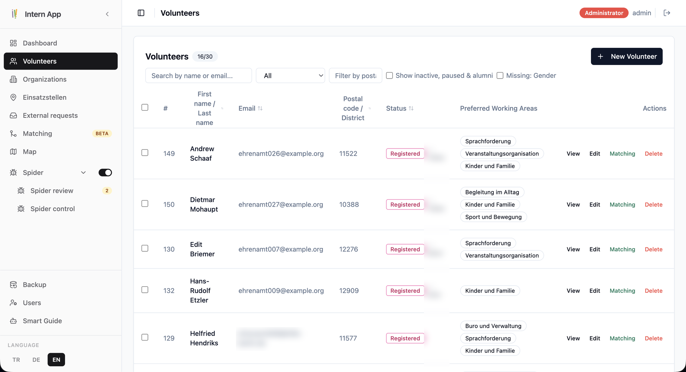
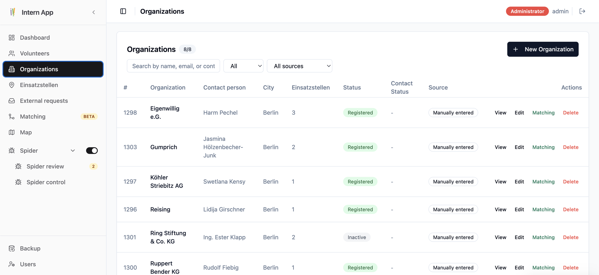
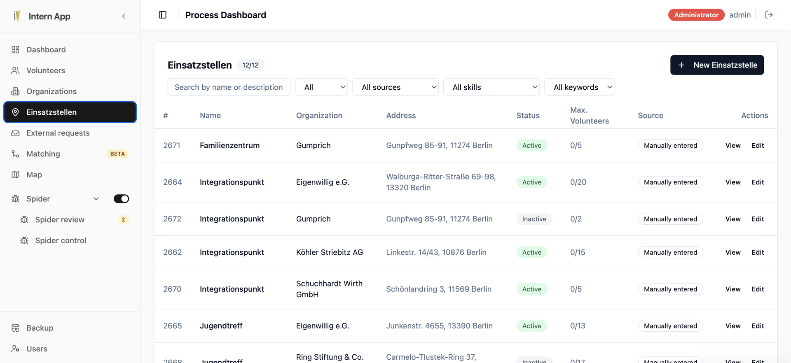

# Volunteer Matching Platform – Case Study

> An internal web application for a Berlin nonprofit (MachMit-Zentrum e.V.) that matches volunteers with placements (Einsatzstellen) at partner organisations.
> **This repository contains no source code and no personal data.** The application is private and runs only on the association's local network for data-protection (GDPR) reasons. This page documents the problem, architecture and engineering decisions.

**Role:** Lead developer (volunteer), from first prototype to production use, 2025 – today
**Stack:** React 18 · TypeScript · Vite · Tailwind CSS · Radix UI / shadcn · Zustand · i18next · Leaflet · Vitest · Cypress · Django 5 / DRF · SQLite · Docker Compose · Nginx

---

## The problem

The association connects volunteers with partner organisations across Berlin. Before this tool, matching was done by hand with spreadsheets. The staff who use the tool daily are **not technical**, and volunteer data is highly sensitive (contact details, residence status, availability).

Constraints:
- Must be usable by people with low digital literacy
- Must run **offline on the local network** – no cloud hosting of personal data
- Must be maintainable by someone else if I step back (hence moved to the association's own GitHub organisation)

## What I built

| Area | What it does |
|---|---|
| **Volunteers** | Multi-step wizard form, languages with CEFR levels, weekly availability grid, preferred activity fields, change history |
| **Organisations & placements** | Organisations with multiple placements, each with its own address, contacts and open offers |
| **Matching** | Rule-based filtering + weighted compatibility score between volunteers and placements; staff review suggestions and assign – a human always decides |
| **Map** | Leaflet map of volunteers and placements (geocoded addresses) |
| **Import** | Excel import with column preview and mapping |
| **Scraper pipeline** | Python spider that collects placement listings from 7 public platforms into a review queue |
| **External form** | Public sign-up form that writes into a moderated queue through one narrow API endpoint |
| **Operations** | Auth and user management, backup/restore to USB with automatic fallback, print views, guided product tours (driver.js), UI in German/English/Turkish |

## Architecture

- **Monorepo with submodules**: `frontend`, `backend` and `spider` are separate repositories, composed with Docker Compose.
- **Minimal attack surface**: only one endpoint is reachable from outside; everything else stays on the LAN.

## Frontend engineering (≈ 180 TypeScript files)

- **Component architecture**: refactored monolithic edit pages into shared form primitives (`FieldError`, `SectionHeader`, `ContactPersonList`, `MultiSelectWithCustomOption`, …) and domain sections (`volunteer/`, `einsatzstelle/`, `matching/`), on top of a Radix/shadcn UI layer.
- **Written frontend standards** – e.g. a strict error-visibility rule for all forms:
  - one error shape (`Record<string, string[]>`) for client and server validation
  - inline error under the exact input, red border and `aria-invalid`
  - validate on blur, clear on change
  - scroll to and focus the first invalid field, switching wizard steps if needed
  - errors that don't belong to a field are shown in a page-level alert – nothing is swallowed
- **State & i18n**: Zustand stores, i18next with three locales, admin-editable UI labels.
- **Testing**: Vitest + Testing Library for units, Cypress for end-to-end flows.

## AI-assisted / agentic workflow

I develop with Claude Code and project-specific agents, each with a narrow role:

| Agent | Role |
|---|---|
| `architecture-brainstormer` | Sparring partner for architecture and data-model decisions – discusses, doesn't code |
| `component-decomposer` | Proposes how to split large components into reusable parts |
| `tech-lead-reviewer` | Reviews changes for logic errors and architectural fit |
| `cypress-qa-lead` | Writes and reviews end-to-end tests after new pages or API changes |

Human oversight stays in the loop: agents propose, I review and decide. Project rules (like the error-visibility standard above) are written down so that people and agents follow the same conventions.

## Screenshots

_All screenshots use generated demo data – no real people or organisations. UI shown in English (also available in German and Turkish)._

### Process dashboard
KPIs for volunteers, matching suggestions and active placements, plus the distribution of volunteers by status.

### Map
Volunteers (triangles, coloured by status) and placements (rings, coloured by occupancy) on a Leaflet map, with toggleable layers and a legend.

### Volunteers
Searchable, filterable list with status badges, preferred working areas and quick actions (view, edit, matching).

### Organisations and placements
Organisations with their contact persons and placements. Each placement has its own address, capacity and data source (manual entry or scraper).

## Outcome

- Used by the association's staff for their volunteer coordination work
- Code and documentation handed over to the association's own GitHub organisation so the project can continue without me

---

Published with the permission of MachMit-Zentrum e.V.
Contact: [github.com/etmeseh](https://github.com/etmeseh) · oncuol.etka@gmail.com
